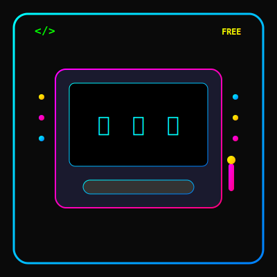

```
  ██████╗ ██████╗ ███████╗███╗   ██╗    ███╗   ██╗███████╗ ██████╗ ███╗   ██╗
 ██╔═══██╗██╔══██╗██╔════╝████╗  ██║    ████╗  ██║██╔════╝██╔═══██╗████╗  ██║
 ██║   ██║██████╔╝█████╗  ██╔██╗ ██║    ██╔██╗ ██║█████╗  ██║   ██║██╔██╗ ██║
 ██║   ██║██╔═══╝ ██╔══╝  ██║╚██╗██║    ██║╚██╗██║██╔══╝  ██║   ██║██║╚██╗██║
 ╚██████╔╝██║     ███████╗██║ ╚████║    ██║ ╚████║███████╗╚██████╔╝██║ ╚████║
  ╚═════╝ ╚═╝     ╚══════╝╚═╝  ╚═══╝    ╚═╝  ╚═══╝╚══════╝ ╚═════╝ ╚═╝  ╚═══╝
```

✨ **Open Neon Slot** ✨

---

<h1 style="display: flex; align-items: center; gap: 1rem; margin-bottom: 1rem;">
  
  <span>Open Neon Slot</span>
</h1>

Bem-vindo ao **Open Neon Slot**, um caça-níquel open-source em puro estilo **neon arcade**!
Este projeto foi criado para **fins educacionais**, com o objetivo de mostrar um algoritmo próximo ao funcionamento real de uma slot machine.

💡 Não envolve apostas de verdade — aqui a diversão é **aprender** e **experimentar**!

## 🕹️ Tecnologias usadas

⚙️ [Astro](https://astro.build/) — framework ultrarrápido para web  
🎨 [TailwindCSS](https://tailwindcss.com/) — estilo responsivo e moderno  
💎 [Astro Icon](https://github.com/natemoo-re/astro-icon) — ícones para completar a estética arcade

## 🚀 Como rodar o projeto

Clone o repositório e acenda as luzes do cassino:

```bash
git clone [https://github.com/seu-usuario/open-neon-slot.git](https://github.com/seu-usuario/open-neon-slot.git)
cd open-neon-slot
```

Instale as dependências mágicas:

```bash
npm install
```

Inicie o cassino no modo desenvolvimento 🕹️:

```bash
npm run dev
```

Gere a versão de produção 💻:

```bash
npm run build
```

Pré-visualize sua máquina brilhando em neon 🌟:

```bash
npm run preview
```

## 🎯 Objetivo do projeto

O **Open Neon Slot** não é sobre dinheiro, mas sobre **conhecimento**\!
Aqui você encontra um exemplo prático de como funcionam os **algoritmos de caça-níquel**, com:

- 🎲 Geração de resultados pseudoaleatórios
- 🎰 Simulação de rolagem ou movimento dos rolos
- 📊 Base para estudo e experimentação

## 📜 Licença

📄 Este projeto está sob a licença [MIT](https://opensource.org/licenses/MIT).
Use, modifique e brilhe em neon\! ✨

### 🌐 Entre no ritmo arcade:

**Aprenda, brinque e explore o código como se fosse um verdadeiro cassino em estilo neon\!**
